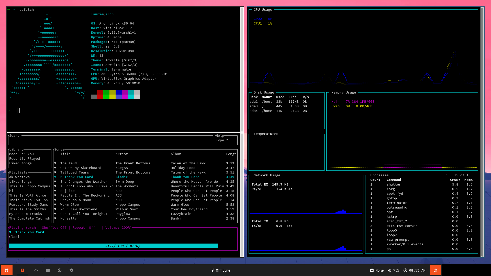

# Dotfiles
My dotfiles, here is a preview of my Desktop

## Dependencies
- WM: [i3-gaps](https://archlinux.org/packages/community/x86_64/i3-gaps/)
- Terminal: [terminator](https://archlinux.org/packages/community/any/terminator/)
- Shell: [zsh](https://wiki.archlinux.org/index.php/zsh) + [oh-my-zsh](https://ohmyz.sh/)
- Bar: [polybar](https://wiki.archlinux.org/index.php/Polybar) + [polybar-themes](https://github.com/adi1090x/polybar-themes)
- Launcher: [Rofi](https://wiki.archlinux.org/index.php/Rofi) + [dmenu](https://tools.suckless.org/dmenu/)
- Background manager: [Feh](https://feh.finalrewind.org/)
- Audio: [Pulseaudio](https://en.wikipedia.org/wiki/PulseAudio)
